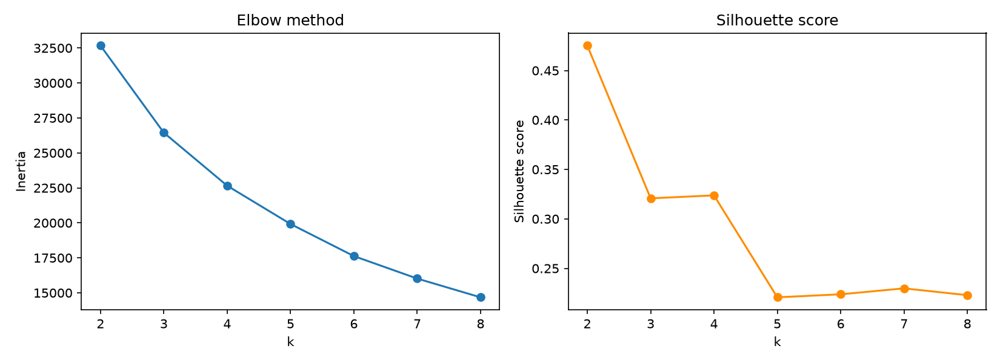
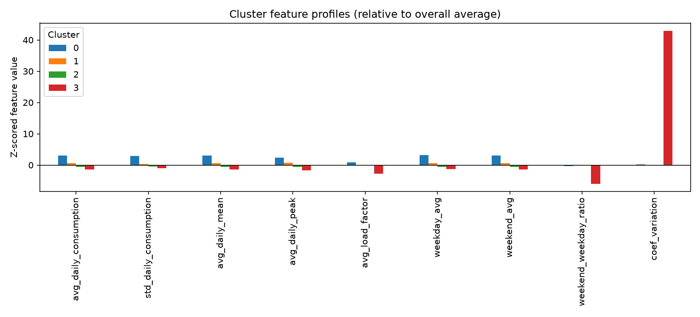

# Smart Meters London — Load Profiling & Customer Segmentation

Clustering London households into electricity consumption archetypes using
the [Smart Meters in London](https://www.kaggle.com/datasets/jeanmidev/smart-meters-in-london)
(LCL) dataset, and comparing cluster membership against ACORN demographic
groups.

Segmentation is based on the **daily** dataset only (no half-hourly data),
so instead of clustering by load-curve *shape* (e.g. "evening peaker" vs
"morning peaker"), households are grouped by consumption *character*:
overall usage level, day-to-day variability, "peakiness," and weekday vs.
weekend behavior.

## Project background

Daily electricity consumption aggregates from ~5,500 London households
(Nov 2011–Feb 2014), collected by UK Power Networks as part of the Low
Carbon London project. Includes household ACORN demographic classification
and tariff type (standard vs. dynamic time-of-use).

## Repo structure

```
.
├── data/
│   ├── raw/                        # raw Kaggle CSVs — NOT committed (see .gitignore)
│   └── processed/
│       ├── daily/                  # daily_part_*.parquet (<25MB each)
│       ├── acorn_details.csv
│       ├── informations_households.csv
│       ├── daily_cluster_features.csv       # generated
│       ├── daily_cluster_assignments.csv    # generated
│       ├── daily_cluster_acorn_crosstab.csv # generated
│       ├── daily_k_selection.png            # generated
│       └── daily_cluster_profiles.png       # generated
├── scripts/
│   ├── smart_meters_lib.py         # raw CSV -> parquet conversion (import only)
│   ├── run_smart_meters.py         # run this first: converts daily_dataset CSVs
│   ├── daily_segmentation_lib.py   # feature engineering from daily data
│   ├── segmentation_lib.py         # clustering utilities (k-selection, KMeans, ACORN cross-tab)
│   ├── run_daily_segmentation.py   # run this second: full clustering pipeline
│   └── dashboard.py                # interactive Dash app for exploring clusters
├── requirements.txt
└── README.md
```

## Setup

```bash
pip install -r requirements.txt
```

## Usage

**Local (Spyder) or GitHub Codespaces both work** — paths in the scripts
are relative (`../data/...`), so no editing is needed if you keep the
folder structure above.

1. **Convert raw data to parquet** (skip if `data/processed/daily/` already
   has `.parquet` files):
   ```bash
   cd scripts
   python run_smart_meters.py
   ```
   Point `data_root` inside the script at your extracted Kaggle download
   folder if running locally.

2. **Run the segmentation pipeline:**
   ```bash
   python run_daily_segmentation.py
   ```
   This builds per-household features, scans k=2–8 for the best cluster
   count (elbow + silhouette), fits the final KMeans model, cross-tabs
   clusters against ACORN groups, and saves plots + CSVs to
   `data/processed/`. Review `daily_k_selection.png` and adjust `K` in the
   script if needed, then re-run.

3. **Explore results interactively:**
   ```bash
   python dashboard.py
   ```
   Opens a local Dash app on `http://127.0.0.1:8050` (or a forwarded port
   in Codespaces) with a cluster filter, feature profile chart, ACORN mix
   chart, and household sample table. Set `DASH_DEBUG=1` for the
   auto-reloading dev server, or `DASH_HOST=0.0.0.0` to bind beyond
   localhost — only do the latter on a trusted network, since debug mode
   combined with a non-localhost bind exposes the interactive Werkzeug
   debugger.

## Results

Output of the current pipeline run (`K=4`), committed under `data/processed/`:

| file | contents |
|---|---|
| `daily_cluster_features.csv` | 5,560 households × 9 engineered features + cluster + ACORN group (feeds the dashboard directly) |
| `daily_cluster_assignments.csv` | `LCLid`, `cluster`, ACORN group / tariff — one row per household |
| `daily_cluster_acorn_crosstab.csv` | cluster × ACORN group, row-normalized to % |
| `daily_k_selection.png` | elbow (inertia) + silhouette score for k=2–8 |
| `daily_cluster_profiles.png` | z-scored feature-mean bar chart per cluster |




**Cluster archetypes** (mean `avg_daily_consumption` in kWh/day, `n` households):

| cluster | n | avg daily kWh | day-to-day CV | weekend/weekday ratio | reading |
|---|---|---|---|---|---|
| 0 | 262 | 33.3 | 0.48 | 1.00 | heavy, high-variance users |
| 1 | 1,848 | 14.5 | 0.38 | 1.07 | moderate users, slightly weekend-heavy |
| 2 | 3,448 | 6.1 | 0.38 | 1.06 | light users — the bulk of the panel |
| 3 | 2 | ~0.0 | 16.9 | 0.23 | near-zero readings — likely vacant/faulty meters, not a real segment |

Cluster 3 is a 2-household outlier bucket rather than a genuine archetype;
a useful next step is to filter near-zero-consumption households out before
clustering so `K` isn't spent isolating them.

**ACORN mix per cluster** (% of households, from `daily_cluster_acorn_crosstab.csv`):

| cluster | ACORN- | ACORN-U | Adversity | Affluent | Comfortable |
|---|---|---|---|---|---|
| 0 | 0.0 | 2.7 | 10.7 | 69.5 | 17.2 |
| 1 | 0.1 | 0.8 | 26.4 | 42.3 | 30.5 |
| 2 | 0.0 | 0.8 | 37.6 | 35.6 | 26.0 |
| 3 | 0.0 | 0.0 | 50.0 | 0.0 | 50.0 |

Consumption level tracks affluence directionally (cluster 0's heavy users
skew "Affluent," cluster 2's light users skew "Adversity"/"Comfortable"),
but the overlap is large — ACORN group alone would misclassify most
households, which is the case for usage-based segmentation over a
demographic-only one.

## Project plan

1. ✅ **Data prep** — convert raw CSVs to parquet (`scripts/run_smart_meters.py`)
2. ✅ **Feature engineering** — per-household features from daily aggregates
   (`daily_segmentation_lib.py`)
3. ✅ **Clustering** — k-means with elbow/silhouette-based k selection
4. ✅ **Cluster interpretation** — ACORN demographic cross-tab
5. ✅ **Dashboard** — interactive cluster explorer (`dashboard.py`)
6. **Write-up** — methodology, findings, and how this translates to
   utility-side customer segmentation *(next)*

## Data source

UK Power Networks, "SmartMeter Energy Consumption Data in London
Households," via [London Datastore](https://data.london.gov.uk/) /
[Kaggle](https://www.kaggle.com/datasets/jeanmidev/smart-meters-in-london).
